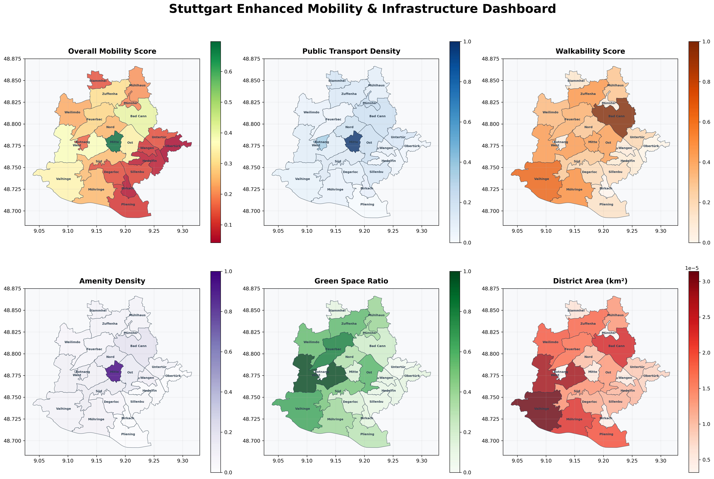
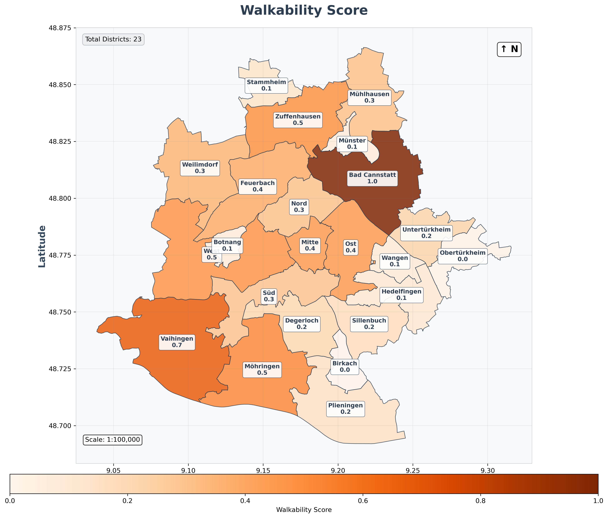
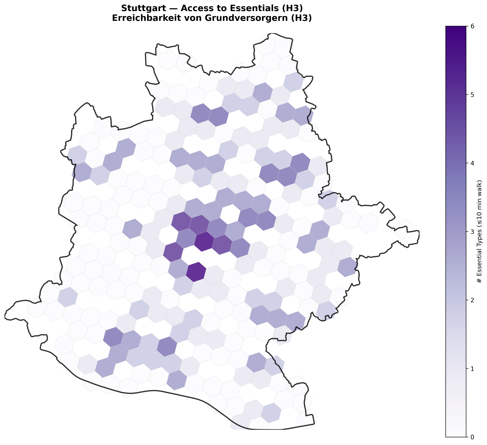

# ETL Geodata Pipeline

**Author:** Manoela Calabresi – Urban Planner & Spatial Analyst
**LinkedIn:** [linkedin.com/in/manoela-calabresi](https://www.linkedin.com/in/manoela-calabresi/)

**🟪 Python + PostGIS ETL Pipeline for Multi-City Urban Analysis**

---

## 🔺 Overview

The **ETL Geodata Pipeline** is a production-ready system that transforms **OpenStreetMap (OSM) data** into categorized, analysis-ready layers.

* **Languages & Tools**: Python, PostgreSQL 17, PostGIS 3.5, QuackOSM, GeoPandas
* **Purpose**: Enable scalable **city-agnostic urban analysis** (walkability, transport, land use, accessibility).
* **Architecture**: Modular, config-driven, multi-city design with reusable core components.

---

## 🔺 Key Features

* **✅ Database Integration**: PostgreSQL + PostGIS with CLI & Python API
* **✅ Scalable Architecture**: City templates, modular design, YAML configs
* **✅ OSM Data Processing**: QuackOSM extraction with <1% uncategorized data
* **✅ Visualization**: Clean thematic maps & dashboards (Curitiba & Stuttgart)
* **✅ Testing & Validation**: Automated smoke tests for each city module

---

## 🔺 Visual Outputs

| Example                                                                     | Description                                                              |
| --------------------------------------------------------------------------- | ------------------------------------------------------------------------ |
|        | **Mobility Dashboard** – PT density, walkability, green space, amenities |
|  | **Walkability Analysis** – pedestrian-friendly zones across Stuttgart    |
|            | **Essential Services Access** – 10-min walk analysis using H3 grid       |

---

## 🔺 Project Structure

```
ETL-Geodata-Pipeline/
├── cities/                 # 🟪 City-specific modules
│   ├── stuttgart/          # 🟨 Stuttgart analysis
│   └── curitiba/           # 🟨 Curitiba analysis
├── spatial_analysis_core/  # 🔺 Shared PostGIS + Data Loader
├── data_final/             # 🔺 Processed city data
├── map_examples/           # 🟪 Map outputs
└── pipeline/               # 🔻 Legacy (deprecated)
```

* **🟪 Core** – PostGIS integration, QuackOSM loader, CLI tools
* **🟨 Active Cities** – Stuttgart & Curitiba (both fully tested)
* **🔻 Legacy** – Old pipeline kept for reference

---

## 🔺 Quick Start

### Requirements

* Python 3.8+
* PostgreSQL 17 + PostGIS 3.5
* \~2GB free disk space

```bash
# Clone repo
git clone <repository-url>
cd ETL-Geodata-Pipeline

# Install dependencies
pip install -r requirements.txt
pip install quackosm geopandas

# Setup PostGIS database
python spatial_analysis_core/database/manage_database.py setup
python spatial_analysis_core/database/manage_database.py enable-postgis

# Run full pipeline (Curitiba example)
python cities/curitiba/spatial_analysis/test_curitiba_full_pipeline.py
```

---

## 🔺 Skills Demonstrated

* **ETL Development** – multi-stage pipelines with staging, processing, and outputs
* **Software Architecture** – modular, scalable, city-agnostic system design
* **GeoIT Programming** – Python + PostGIS + QuackOSM integration
* **Data Quality** – intelligent categorization (>99% features classified)
* **Visualization** – thematic maps, dashboards, and KPIs for urban planning

---

## 🟪 Next Steps

* Add Paris & Berlin using city templates
* Dockerize for cloud deployment
* Integrate automated OSM updates & web dashboards

---

## 🟣 Acknowledgments

* OpenStreetMap contributors
* QuackOSM team
* GeoPandas community
* Stuttgart Open Data portal

---

**Project Status**: ✅ Fully Operational – Multi-City Pipeline with PostGIS Integration

📖 **Full documentation available in [/docs](./docs)**

The `/docs` folder contains comprehensive technical documentation:

| Document | Purpose | For |
|----------|---------|------|
| [Architecture](docs/architecture.md) | System design & structure | Developers, Architects |
| [Database](docs/database.md) | Database setup & API | DevOps, Backend Devs |
| [Data Layers](docs/data_layers.md) | Data processing & categories | Data Scientists, Analysts |
| [Multi-City](docs/multi_city.md) | Pipeline execution & cities | Urban Planners, Researchers |
| [Visual Outputs](docs/visual_outputs.md) | Maps & dashboards | Stakeholders, Clients |
| [Troubleshooting](docs/troubleshooting.md) | Problem solving | Support, Maintenance |
