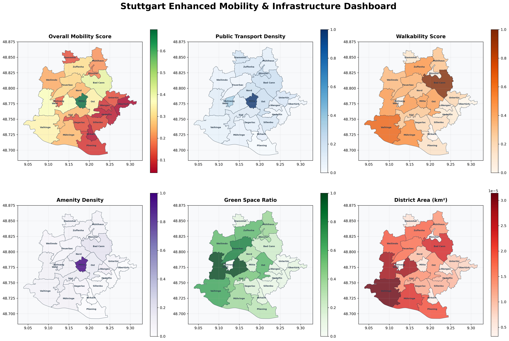
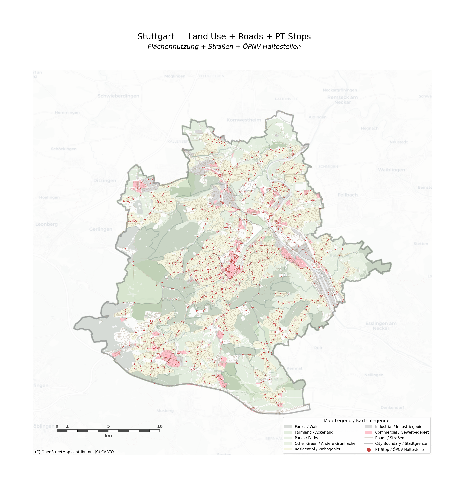
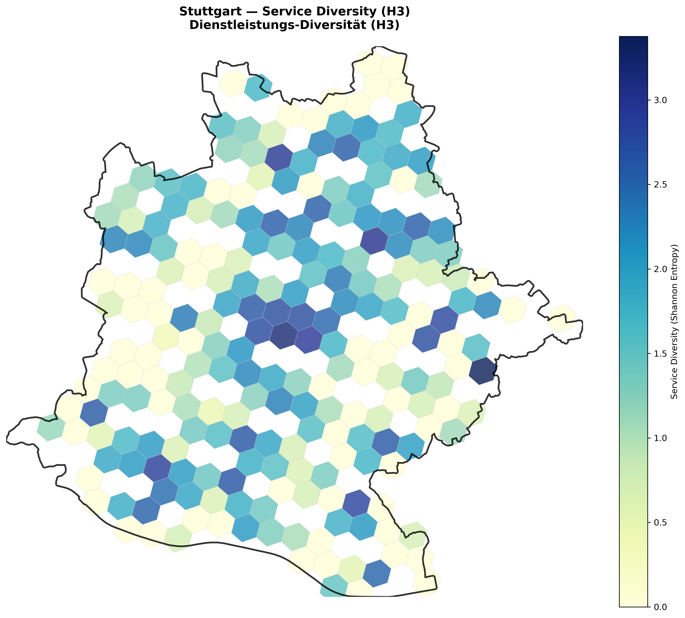

# ETL Geodata Pipeline - Comprehensive Documentation

**Author:** Manoela Calabresi, Urban Planner & Spatial Analyst  
**LinkedIn:** [https://www.linkedin.com/in/manoela-calabresi/](https://www.linkedin.com/in/manoela-calabresi/)

## 🔺 Project Overview

The **ETL Geodata Pipeline** is a scalable, city-agnostic system for processing OpenStreetMap (OSM) geodata into meaningful, categorized layers. Built with Python and designed for urban analysis, this pipeline transforms raw OSM data into clean, categorized datasets ready for analysis and visualization.

**🎯 Designed for Smart City & Urban Digital Twin Applications** - This pipeline serves as the foundational infrastructure for urban geodata platforms, enabling real-time analysis of mobility patterns, infrastructure utilization, and urban development trends.

### Key Features
- **🟪 City-Agnostic**: Add new cities by simply creating YAML configuration files
- **🟪 Intelligent Categorization**: Reduces "other" categories from 60k+ to <1% through smart classification
- **🟪 Comprehensive Coverage**: Processes 6 thematic layers with 50+ total categories
- **🟪 Dual Visualization**: Both clean and detailed map generation
- **🟪 Efficient Processing**: Uses QuackOSM for fast OSM data extraction
- **🟪 Clean Architecture**: Modular design with clear separation of concerns
- **🟪 Optimized Storage**: Comprehensive .gitignore prevents large files from cluttering repository
- **🟪 Database Integration**: DuckDB for efficient data storage and querying
- **🟪 OSM Data Integration**: Direct processing of OpenStreetMap data through QuackOSM and PBF files

---

## 🔺 Visual Outputs Showcase

### 🔺 Stuttgart Enhanced Mobility & Infrastructure Dashboard

*Comprehensive mobility analysis showing overall scores, public transport density, walkability, amenity density, green space ratio, and district areas across Stuttgart's districts*

### 🔺 Access to Essential Services

*H3 hexagonal grid visualization of essential services accessibility within 10-minute walking distance*

### 🔺 Land Use, Roads & Public Transport Overview

*Comprehensive overview of land use, road networks, and public transport infrastructure across Stuttgart*

### 🔺 Walkability Score Analysis

*Enhanced walkability scoring analysis showing pedestrian-friendly areas and accessibility patterns across Stuttgart*

### 🔺 Service Diversity Distribution

*Service diversity analysis using Shannon Entropy across Stuttgart's hexagonal grid*

---

## 🔺 Project Structure

```
ETL-Geodata-Pipeline/
├── pipeline/                    # 🔺 Core Pipeline Components
│   ├── config/                 # 🟪 Configuration Files
│   │   ├── pipeline.yaml       # Main pipeline settings
│   │   ├── osm_filters.yaml    # OSM extraction filters
│   │   ├── *_rules.yaml        # Category mapping rules (8 files)
│   ├── scripts/                # 🟣 Python Scripts
│   │   ├── extract_quackosm.py # [STEP 1] OSM data extraction
│   │   ├── process_layers.py   # [STEP 2] Data processing & categorization
│   │   ├── create_clean_maps.py     # [STEP 3A] Clean map generation
│   │   ├── create_thematic_maps.py  # [STEP 3B] Detailed map generation
│   │   ├── test_pipeline.py    # [STEP 0] Pipeline testing
│   │   └── utils.py            # Shared utilities
│   ├── areas/                  # 🟨 City-Specific Configurations
│   │   └── stuttgart.yaml      # Stuttgart parameters
│   └── EXECUTION_ORDER.md      # 🔻 Detailed execution guide
├── spatial_analysis/           # 🔺 Multi-City Analysis Pipeline
│   ├── config/                 # 🟪 Analysis configuration
│   ├── scripts/                # 🟣 Reusable pipeline (1,2,3)
│   │   ├── 1_data_collection.py    # Data collection & processing
│   │   ├── 2_kpi_calculation.py    # KPI computation
│   │   └── 3_visualization.py      # Map generation & dashboards
│   ├── data/                   # 🟨 Multi-city data structure
│   │   └── stuttgart/          # City-specific data
│   ├── areas/                  # 🟨 Geographic definitions
│   └── spatialviz/             # 🟣 All visualization & outputs
│       ├── map_generators/     # Map creation scripts
│       ├── outputs/            # Generated maps & dashboards
│       └── utils/              # Visualization utilities
├── data_final/                 # 🔺 Processed Data by City
│   └── stuttgart/
│       ├── raw/               # Original OSM PBF files
│       ├── staging/           # Extracted thematic layers
│       ├── processed/         # Categorized & enhanced data
│       └── maps/
│           ├── clean/         # Clean, readable maps
│           └── detailed/      # Comprehensive thematic maps
├── docs/                      # 🟪 Documentation
│   ├── README_FINAL.md        # Comprehensive documentation
│   └── requirements.txt       # Python dependencies
├── test_data/                 # 🔺 Test data for smoke testing
├── archive/                   # 🟣 Archived Systems
│   └── stuttgart-etl-old/     # Previous system backup
└── .gitignore                 # 🟪 Comprehensive file filtering
```

---

## 🔻 Quick Start Guide

### Prerequisites
- **Python 3.8+**
- **Git** (for cloning)
- **~2GB free disk space** (for Stuttgart data)

### Installation

1. **Clone Repository**
   ```bash
   git clone <repository-url>
   cd ETL-Geodata-Pipeline
   ```

2. **Install Dependencies**
   ```bash
   pip install -r docs/requirements.txt
   pip install -r spatial_analysis/requirements.txt
   ```

3. **Verify Installation**
   ```bash
   python pipeline/scripts/test_pipeline.py --city stuttgart --test
   ```

---

## 🟪 Pipeline Execution Order

### **STEP 0** 🔺 **Test Pipeline** *(Optional - Recommended for first run)*
```bash
python pipeline/scripts/test_pipeline.py --city stuttgart --test
```
- **Purpose**: Quick validation with small bounding box
- **Output**: Test extraction + processing for landuse layer
- **Duration**: ~2-3 minutes
- **Use Case**: First-time setup, debugging, development

### **STEP 1** 🔻 **Extract OSM Data** *(Required)*
```bash
python pipeline/scripts/extract_quackosm.py --city stuttgart
```
- **Purpose**: Extract thematic layers from OSM PBF files
- **Input**: `data_final/stuttgart/raw/baden-wuerttemberg-latest.osm.pbf`
- **Output**: 6 layers → `data_final/stuttgart/staging/`
- **Duration**: ~15-20 minutes
- **Layers Extracted**:
  - 🛣️ Roads (76,620 features)
  - 🏢 Buildings (380,019 features)  
  - 🌳 Landuse (12,913 features)
  - 🚴 Cycling Infrastructure (4,877 features)
  - 🏪 Amenities (62,087 features)
  - 🚌 Public Transport Stops (8,299 features)

### **STEP 2** 🟪 **Process & Categorize Data** *(Required)*
```bash
python pipeline/scripts/process_layers.py --city stuttgart
```
- **Purpose**: Apply intelligent categorization to extracted layers
- **Input**: Staged layers from Step 1
- **Output**: Categorized data → `data_final/stuttgart/processed/`
- **Duration**: ~2-3 minutes
- **Key Achievements**:
  - 🎯 Amenities: 62,087 → 21 categories (only 522 "other")
  - 🚌 PT Stops: 8,299 → 12 categories (only 4 "other")
  - 🏢 Buildings: 380,019 → 8 functional categories
  - 🛣️ Roads: 76,620 → 7 hierarchy categories

### **STEP 3A** 🟣 **Generate Clean Maps** *(Recommended)*
```bash
python pipeline/scripts/create_clean_maps.py
```
- **Purpose**: Create clean, readable visualizations
- **Input**: Processed data from Step 2
- **Output**: 3 clean maps → `data_final/stuttgart/maps/clean/`
- **Duration**: ~2-3 minutes
- **Maps Generated**:
  - 🚌 `stuttgart_clean_pt_stops.png` - Main transport infrastructure
  - 🌆 `stuttgart_clean_overview.png` - Simplified city overview
  - 🏪 `stuttgart_clean_amenities.png` - Key services only

### **STEP 3B** 🟨 **Generate Detailed Maps** *(Alternative)*
```bash
python pipeline/scripts/create_thematic_maps.py
```
- **Purpose**: Create comprehensive detailed visualizations
- **Input**: Processed data from Step 2
- **Output**: 7 detailed maps → `data_final/stuttgart/maps/detailed/`
- **Duration**: ~5-8 minutes
- **Maps Generated**: All layers with complete categorization

---

## 🔺 Data Layers & Categories

### 🔻 **Public Transport (12 Categories)**
| Category | Count | Description |
|----------|-------|-------------|
| **bus** | 3,836 | Regular bus stops |
| **railway_station** | 816 | Train stations |
| **railway_platform** | 550 | Train platforms |
| **platform** | 350 | General PT platforms |
| **stop_position** | 2,198 | Stop positions |
| **transport_service** | 157 | Info boards, entrances |
| **taxi** | 130 | Taxi stands |
| **u_bahn** | 112 | Subway entrances |
| **tram** | 107 | Tram stops |
| **bus_station** | 24 | Bus terminals |
| **transport_hub** | 15 | Major interchanges |
| **other** | 4 | Unclassified (0.05%) |

### 🟪 **Amenities (21 Categories)**
| Category | Count | Description |
|----------|-------|-------------|
| **parking** | 19,850 | Parking spaces & facilities |
| **street_furniture** | 14,379 | Benches, shelters, fountains |
| **waste_management** | 8,517 | Bins, recycling, disposal |
| **utilities** | 4,347 | Vending machines, toilets |
| **food_beverage** | 4,316 | Restaurants, cafes, bars |
| **transport** | 2,125 | Fuel, charging stations |
| **education** | 1,868 | Schools, universities |
| **public_services** | 1,831 | Libraries, post offices |
| **community** | 1,659 | Places of worship, centers |
| **healthcare** | 1,382 | Hospitals, clinics, pharmacies |
| **financial** | 621 | Banks, ATMs |
| **emergency** | 233 | Fire stations, police |
| **maintenance** | 113 | Repair stations |
| **animal_services** | 91 | Veterinary, shelters |
| **commercial** | 66 | Marketplaces, shops |
| **recreation** | 59 | BBQ, picnic sites |
| **construction_logistics** | 53 | Loading docks |
| **funeral_services** | 42 | Funeral halls, crematoriums |
| **research_education** | 8 | Research institutes |
| **accommodation** | 5 | Dormitories |
| **other** | 522 | Unclassified (0.8%) |

### 🟣 **Buildings (8 Categories)**
| Category | Count | Description |
|----------|-------|-------------|
| **residential** | 141,478 | Houses, apartments |
| **transport** | 36,568 | Garages, parking structures |
| **commercial** | 7,666 | Offices, retail, industrial |
| **agriculture** | 2,647 | Barns, farm buildings |
| **civic** | 1,310 | Schools, hospitals, government |
| **utility** | 852 | Power, water infrastructure |
| **religious** | 523 | Churches, temples |
| **other** | 188,975 | Unspecified buildings |

### 🟨 **Roads (7 Categories)**
| Category | Count | Description |
|----------|-------|-------------|
| **service** | 33,128 | Service roads, driveways |
| **residential** | 27,714 | Residential streets |
| **secondary** | 8,029 | Secondary roads |
| **tertiary** | 5,125 | Tertiary roads |
| **primary** | 1,330 | Primary roads |
| **motorway** | 428 | Highways |
| **other** | 866 | Unclassified roads |

### 🔺 **Land Use (4 Categories)**
| Category | Count | Description |
|----------|-------|-------------|
| **agricultural** | 4,438 | Farmland, crops |
| **green** | 2,459 | Parks, forests |
| **urban** | 1,081 | Residential, commercial |
| **other** | 4,935 | Mixed/unclassified |

### 🔻 **Cycling Infrastructure (2 Categories)**
| Category | Count | Description |
|----------|-------|-------------|
| **dedicated_cycleway** | 698 | Dedicated bike paths |
| **other** | 4,179 | Shared paths, lanes |

---

## 🟪 Configuration System

### City Configuration (`pipeline/areas/stuttgart.yaml`)
```yaml
# City-specific parameters
area:
  name: "Stuttgart"
  full_name: "Stuttgart region (Baden-Württemberg)"
  country: "Germany"
  state: "Baden-Württemberg"

# Geographic bounds
bbox: [9.0, 48.6, 9.4, 48.9]  # [min_lon, min_lat, max_lon, max_lat]

# Data sources
data_sources:
  osm_pbf: "data_final/stuttgart/raw/baden-wuerttemberg-latest.osm.pbf"

# Processing settings
processing:
  crs_storage: "EPSG:4326"    # Storage CRS
  crs_analysis: "EPSG:25832"  # Analysis CRS (UTM Zone 32N)
```

### OSM Filters (`pipeline/config/osm_filters.yaml`)
```yaml
# Extraction filters for each layer
roads:
  highway: [motorway, trunk, primary, secondary, tertiary, residential, service]

buildings:
  building: ["*"]  # All building types

amenities:
  amenity: ["*"]   # All amenity types

# ... more layer definitions
```

### Category Rules (`pipeline/config/*_rules.yaml`)
Each layer has its own categorization rules:
- `landuse_rules.yaml` - Land use categories
- `roads_rules.yaml` - Road hierarchy
- `buildings_rules.yaml` - Building functions
- `amenities_comprehensive_rules.yaml` - 21 amenity categories
- `cycle_rules.yaml` - Cycling infrastructure
- `pt_stops_comprehensive_rules.yaml` - Transport categories

---

## 🔺 Adding New Cities

### 1. Create City Configuration
Create `pipeline/areas/your_city.yaml`:
```yaml
area:
  name: "YourCity"
  full_name: "Your City Name"
  country: "Country"

bbox: [min_lon, min_lat, max_lon, max_lat]

data_sources:
  osm_pbf: "data_final/your_city/raw/region-latest.osm.pbf"
```

### 2. Download OSM Data
```bash
# Create directory
mkdir -p data_final/your_city/raw

# Download PBF file (example for Germany)
wget -O data_final/your_city/raw/region-latest.osm.pbf \
  https://download.geofabrik.de/europe/germany-latest.osm.pbf
```

### 3. Run Pipeline
```bash
python pipeline/scripts/extract_quackosm.py --city your_city
python pipeline/scripts/process_layers.py --city your_city
python pipeline/scripts/create_clean_maps.py
```

---

## 🟣 Technical Architecture

### Core Technologies
- **Python 3.8+** - Main programming language
- **QuackOSM** - OSM data extraction engine
- **GeoPandas** - Geospatial data processing
- **Matplotlib** - Map visualization
- **PyYAML** - Configuration management
- **DuckDB** - High-performance analytical database
- **Parquet** - Efficient data storage format

### ETL Development Expertise
- **🔺 Data Pipeline Design**: Multi-stage ETL with staging, processing, and output layers
- **🔺 Data Quality Assurance**: Automated validation and error handling
- **🔺 Performance Optimization**: Memory-efficient processing for large datasets
- **🔺 Configuration Management**: YAML-based system configuration
- **🔺 Error Handling & Logging**: Comprehensive error tracking and debugging
- **🔺 Testing & Validation**: Automated pipeline testing and smoke tests

### Data Flow
```
OSM PBF File → QuackOSM → DuckDB (staging) → 
Category Processing → DuckDB (processed) → 
Map Generation → PNG Visualizations
```

### Performance Characteristics
- **Stuttgart Full Pipeline**: ~25-30 minutes
- **Data Size**: ~120 MB for complete Stuttgart dataset
- **Memory Usage**: ~2-4 GB peak during building processing
- **Scalability**: Linear scaling with city size

### Scalability Features
- **🔺 Multi-Tenant Architecture**: Support for multiple cities with isolated configurations
- **🔺 Horizontal Scaling**: Can process multiple cities in parallel
- **🔺 Database Integration**: DuckDB for efficient data storage and querying
- **🔺 Configuration Management**: YAML-based system configuration
- **🔺 Error Handling**: Comprehensive error tracking and debugging
- **🔺 Testing & Validation**: Automated pipeline testing and smoke tests

---

## 🟨 Key Achievements

### Data Quality Improvements
- **Amenities**: Reduced "other" from 58,000+ to 522 (99.2% categorized)
- **PT Stops**: Reduced "other" from 91,639 to 4 (99.995% categorized)
- **Comprehensive Coverage**: 544,815 total features across all layers
- **Intelligent Processing**: Context-aware categorization for transport

### Technical Excellence
- **Modular Design**: Easy to extend and maintain
- **Configuration-Driven**: No hardcoded city parameters
- **Error Handling**: Graceful failure with detailed logging
- **Documentation**: Comprehensive guides and examples
- **Repository Optimization**: Comprehensive .gitignore prevents large files from cluttering git

### Professional Skills Demonstrated
- **🔺 GeoIT Programming**: Advanced Python development for geospatial applications
- **🔺 Software Architecture**: Clean, scalable system design with clear separation of concerns
- **🔺 ETL Development**: Professional-grade data pipeline engineering
- **🔺 Open Source GIS**: Integration with OSM ecosystems and QGIS-ready data export
- **🔺 Data Pipeline Design**: Multi-stage ETL with staging, processing, and output layers
- **🔺 Configuration Management**: YAML-based system configuration
- **🔺 Project Management**: Comprehensive documentation and execution guides

---

## 🔺 Troubleshooting

### Common Issues

**1. QuackOSM Installation Issues**
```bash
# If QuackOSM fails to install
pip install --upgrade pip
pip install quackosm --no-cache-dir
```

**2. Memory Issues with Large Cities**
```bash
# For cities larger than Stuttgart, increase memory
export QUACKOSM_MAX_MEMORY=8GB
```

**3. Missing OSM Data**
```bash
# Check if PBF file exists
ls -la data_final/stuttgart/raw/
# Re-download if necessary
```

**4. Empty Maps**
- Check bounding box in `pipeline/areas/stuttgart.yaml`
- Verify data was extracted successfully in Step 1
- Check log files for processing errors

### Debug Mode
All scripts support `--debug` flag for verbose logging:
```bash
python pipeline/scripts/extract_quackosm.py --city stuttgart --debug
```

---

## 🟪 Smart City & Urban Digital Twin Capabilities

### Urban Geodata Infrastructure (GDI) Foundation
This pipeline provides the essential data processing capabilities needed for urban analysis and could serve as a foundation for **Urban Geodata Platforms** and **Urban Digital Twins**. The system processes and categorizes urban infrastructure data, enabling comprehensive analysis of mobility patterns, infrastructure distribution, and urban development trends.

### Stuttgart Mobility & Walkability Analysis
A specialized analysis pipeline that builds on the main ETL pipeline to calculate mobility and walkability indicators for Stuttgart's 23 Stadtbezirke (districts).

**Location**: `spatial_analysis/`

**Key Features**:
- **🔺 Public Transport Analysis**: High-frequency stop access, line diversity
- **🔺 Walkability Metrics**: Intersection density, POI accessibility  
- **🔺 Green Space Access**: Distance to public green areas
- **🔺 District Rankings**: Comprehensive mobility scoring
- **🔺 Interactive Maps**: Visualization of results

**Quick Start**:
```bash
# Install additional dependencies
pip install -r spatial_analysis/requirements.txt

# Run analysis (uses main pipeline data)
python spatial_analysis/scripts/1_data_collection.py
```

**See**: `spatial_analysis/QUICKSTART.md` for detailed instructions.

### Stuttgart-Specific Expertise
- **🔺 Deep Local Knowledge**: Comprehensive analysis of Stuttgart's 23 Stadtbezirke
- **🔺 Urban Infrastructure**: Detailed mapping of roads, buildings, amenities, and public transport
- **🔺 Mobility Analysis**: Walkability scores, PT accessibility, and green space access
- **🔺 District Rankings**: Comparative analysis across all Stuttgart districts
- **🔺 Real-World Application**: Practical implementation for urban planning and development

---

## 🔺 Multi-City Analysis Pipeline

### Advanced Urban Mobility & Walkability Analysis
A scalable, multi-city analysis pipeline that processes geospatial data to generate standardized KPIs for transport, walkability, and green space accessibility across multiple cities.

**Location**: `spatial_analysis/`

**Architecture**:
- 🔺 **Modular Pipeline**: 3-stage analysis (data collection → KPI calculation → visualization)
- 🔺 **Multi-City Ready**: Same scripts work for any city with different configurations
- 🔺 **Scalable Structure**: Easy addition of new cities (Paris, Berlin, etc.)
- 🔺 **Standardized KPIs**: Consistent methodology across all cities

**Pipeline Stages**:
1. 🟣 **Data Collection** (`1_data_collection.py`): OSM + GTFS + boundaries
2. 🟪 **KPI Calculation** (`2_kpi_calculation.py`): Transport, walkability, green access
3. 🟣 **Visualization** (`3_visualization.py`): Maps, rankings, dashboards

**Multi-City Structure**:
```
spatial_analysis/
├── data/                       # Multi-city data
│   ├── stuttgart/              # Current city
│   ├── paris/                  # Future city
│   └── berlin/                 # Future city
├── areas/                      # Geographic definitions
└── spatialviz/                 # All outputs
```

**Quick Start**:
```bash
# Install dependencies
pip install -r spatial_analysis/requirements.txt

# Run full pipeline
python spatial_analysis/scripts/1_data_collection.py
python spatial_analysis/scripts/2_kpi_calculation.py
python spatial_analysis/scripts/3_visualization.py

# Modular execution
python spatial_analysis/scripts/1_data_collection.py --gtfs-only
```

**See**: `spatial_analysis/QUICKSTART.md` for detailed instructions.

---

## 🔻 Future Enhancements & Innovation Roadmap


This pipeline could evolve into a comprehensive **Urban Geodata Platform** with future enhancements including:
- **🔺 Automated Data Updates**: Scheduled OSM and GTFS data refresh
- **🔺 Interactive Web Dashboards**: Web-based visualization and exploration
- **🔺 Multi-City Expansion**: Standardized analysis across multiple cities
- **🔺 Enhanced Analytics**: Additional urban development indicators

### Next Steps for Real-Time & Cloud Capabilities
- **🔺 Real-Time Processing**: Apache Kafka for streaming data ingestion, Apache Flink for real-time analytics
- **🔺 Cloud Deployment**: Docker containers with Kubernetes orchestration, AWS ECS or Google Cloud Run
- **🔺 Database Backend**: PostgreSQL with PostGIS extension for spatial data storage
- **🔺 Monitoring & Observability**: Prometheus + Grafana for metrics, ELK stack for logging
- **🔺 CI/CD Pipeline**: GitHub Actions for automated testing and deployment

### Planned Features
1. 🔺 **Multi-City Expansion** - Paris, Berlin, and more cities
2. 🔺 **Enhanced KPI System** - Additional urban development indicators
3. 🔺 **Interactive Web Dashboard** - Web-based visualization and exploration
4. 🔺 **Automated Data Updates** - Scheduled OSM and GTFS refresh
5. 🔺 **Cross-City Benchmarking** - Comparative urban analysis

### Scalability Roadmap
- 🔺 **Multi-City Support** - Standardized analysis across cities
- 🔺 **Database Backend** - Transition from files to database
- 🔺 **Cloud Deployment** - Containerized deployment options
- 🔺 **Enhanced Processing** - Improved performance and memory management
- 🔺 **Extended Analytics** - Additional urban development metrics

---

## 🟪 Contributing

### Development Setup
1. Fork repository
2. Create feature branch
3. Follow existing code style
4. Add tests for new features
5. Update documentation
6. Submit pull request

### Code Standards
- **Python**: Follow PEP 8
- **Documentation**: Comprehensive docstrings
- **Configuration**: YAML for all settings
- **Logging**: Structured logging throughout
- **Testing**: Test new city configurations

---

## 🔺 License

This project is licensed under the MIT License - see the LICENSE file for details.

---

## 🟣 Acknowledgments

- **OpenStreetMap Contributors** - For providing the geodata
- **QuackOSM Team** - For the excellent OSM processing engine
- **GeoPandas Community** - For geospatial Python tools
- **Stuttgart Open Data** - For validation datasets

---

## 🟨 Support

For questions, issues, or contributions:
1. Check existing documentation
2. Review troubleshooting section
3. Search existing issues
4. Create new issue with detailed description

**Project Status**: 🔺 Phase 1 Complete - Multi-City Pipeline Ready & Repository Optimized

---

*Last Updated: 2024-12-19 - Version 1.1.0*