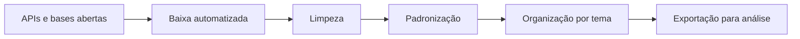
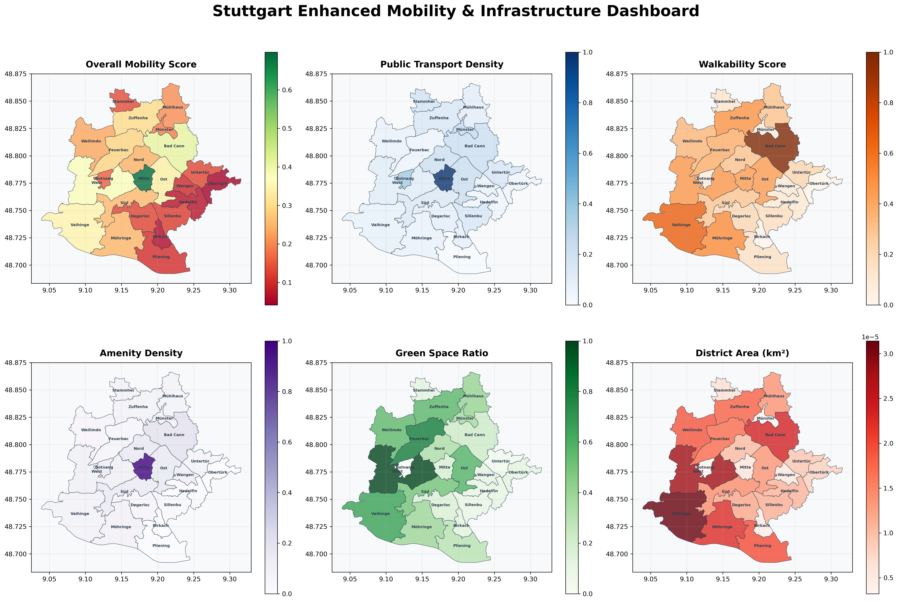
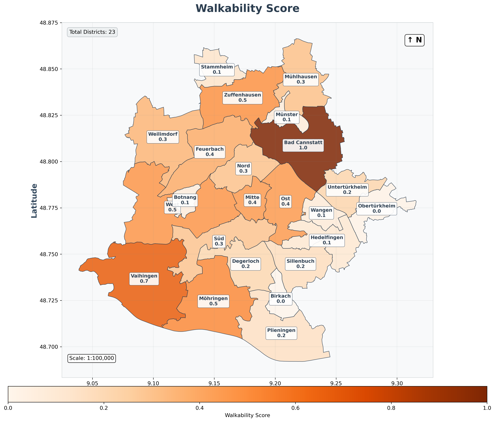
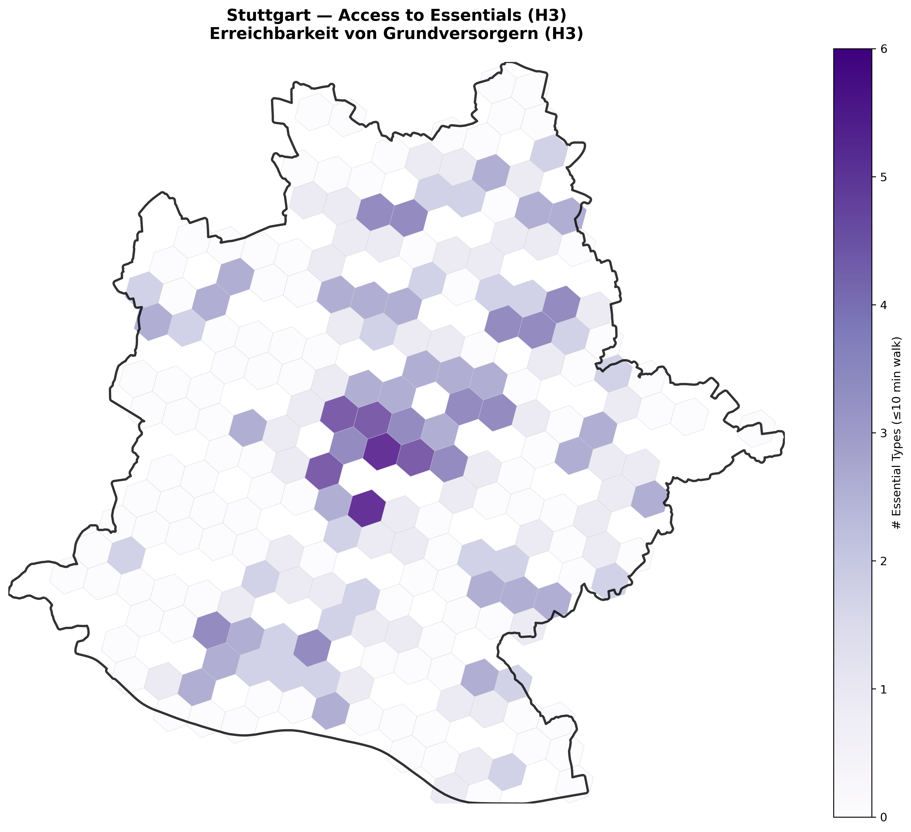

# ETL de geodados · infraestrutura para bases territoriais

Versão em português-BR do projeto **ETL Geodata Pipeline**.

## O que o projeto faz

Pipeline reprodutível para baixar, limpar, padronizar e organizar bases geoespaciais abertas para uso em mapas, indicadores e análises territoriais.

## Problema que resolve

Bases públicas costumam chegar em formatos heterogêneos, com estruturas distintas e alto custo manual de preparação. O pipeline transforma essas fontes em camadas consistentes e reutilizáveis.

## Fluxo

## Bases e arquitetura

- OpenStreetMap;
- ArcGIS REST API;
- camadas administrativas;
- estrutura multi-cidade com componentes reutilizáveis.

## Imagens

### Dashboard territorial

### Walkability

### Acesso a serviços essenciais

## O que o projeto entrega

- bases tratadas para análise;
- camadas georreferenciadas;
- estrutura reprodutível para novos estudos;
- apoio técnico para mapas, indicadores e dashboards.

## Ferramentas

Python · GeoPandas · DuckDB · PostgreSQL · PostGIS · ArcGIS REST API

## Relevância

Dados secundários, georreferenciamento, organização de bases públicas e infraestrutura analítica territorial.

## Ver arquivos do projeto

[Abrir repositório completo](https://github.com/Manoela-Calabresi-Portfolio/ETL-Geodata-Pipeline)
